# foodie9ja-uiux-case-study
UI/UX case study of a marketplace app connecting Nigerians abroad to authentic local restaurants. Designed and prototyped in Figma.

# About Foodie9ja
Foodie9ja is a marketplace mobile app concept designed to support Nigerians living abroad who struggle to locate authentic Nigerian restaurants in their area. Many Nigerians in the diaspora experience homesickness and cultural disconnection, especially when they find it difficult to adapt to foreign meals or cannot easily access familiar local dishes.
The idea behind Foodie9ja is to create a centralized digital platform where Nigerian restaurant owners abroad can list their businesses, and users can easily discover, browse, and order authentic Nigerian meals based on their location.
I independently handled the full design process for this project. The logo, icons, and illustrations were created in Adobe Illustrator to reflect warmth, cultural identity, and familiarity. The interface design, interaction components, and complete user flow were built in Figma.

# The app includes:
	•	Onboarding experience introducing the platform
	•	Sign up and login system
	•	Categorized food menu (Breakfast, Meals, Appetizers)
	•	Add-to-cart functionality with quantity adjustment
	•	Interactive star rating system
	•	Favorites feature
	•	Dark mode toggle for accessibility and comfort
	•	Checkout flow with delivery details
	•	Order confirmation screen
	•	Profile and settings management
The prototype demonstrates a complete end-to-end flow from onboarding to checkout, showcasing interaction design, usability considerations, and product thinking.
This project reflects my interest in designing community-focused digital solutions that solve real-life cultural and accessibility challenges while maintaining clean visual hierarchy and intuitive navigation.

## Screenshots

### Walkthrough
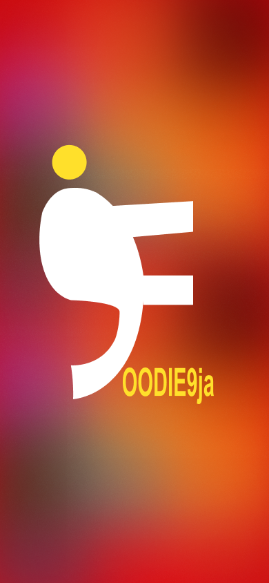

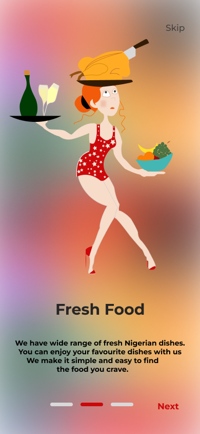

### Authentication
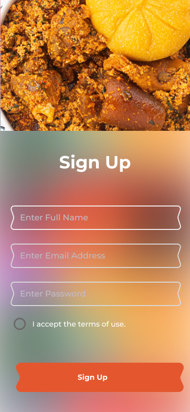
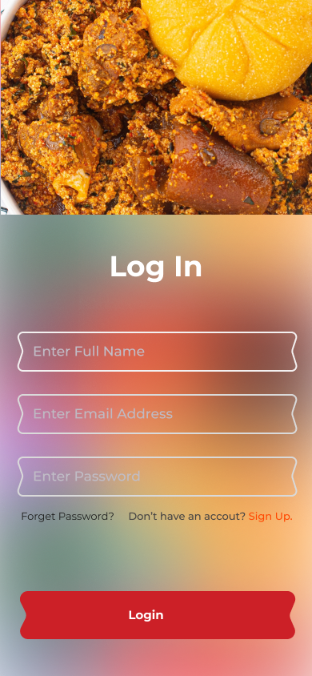

### Home
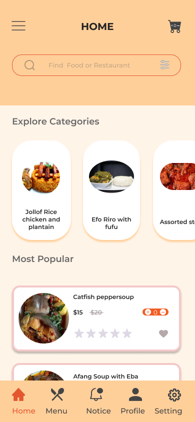
### Home
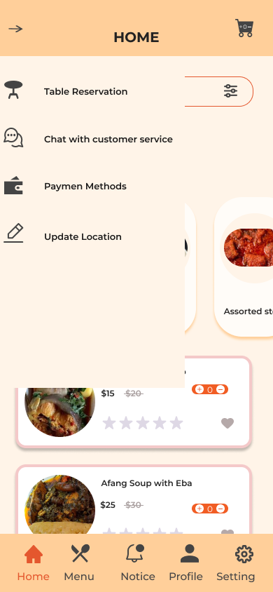

### Menu
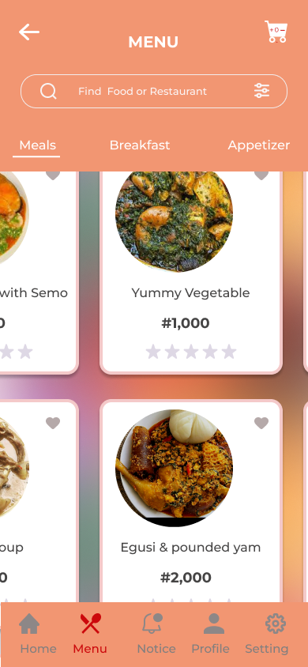
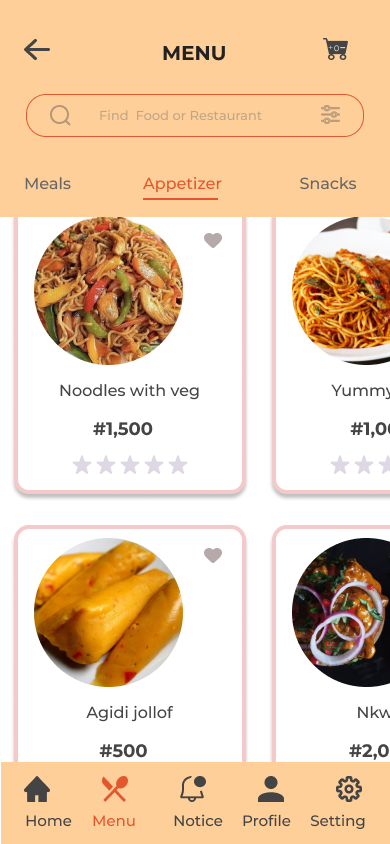
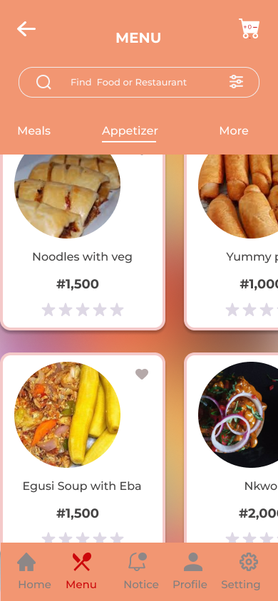
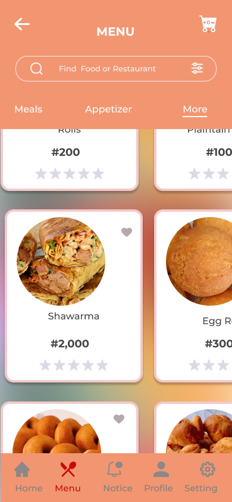

### Checkout
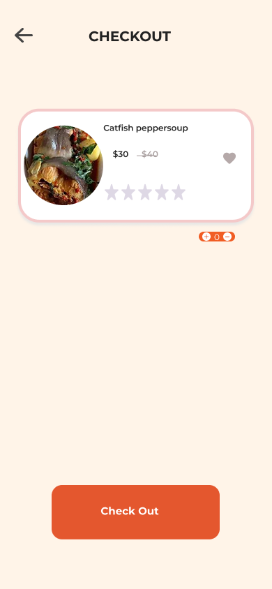
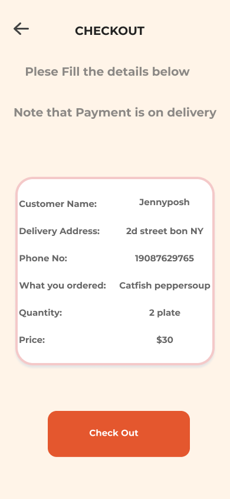

### Dark Mode
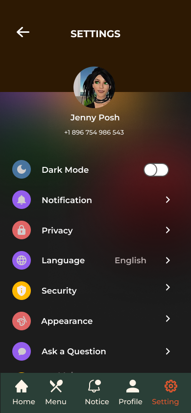

### Order Complete
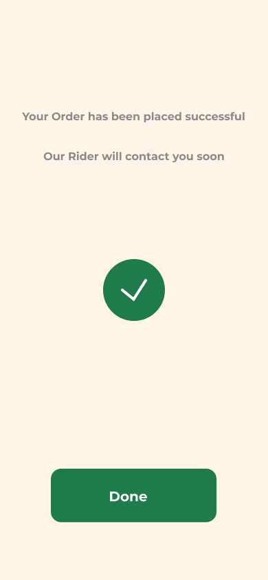

### Profile

### Settings
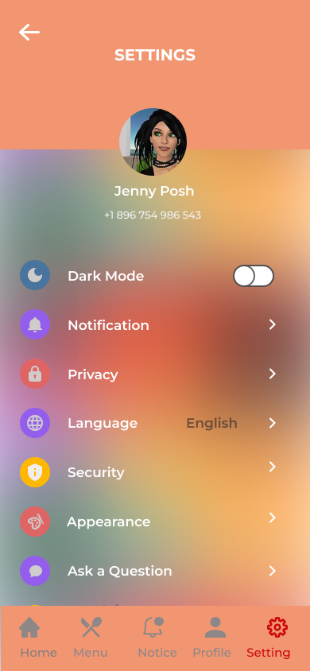

### Notifications
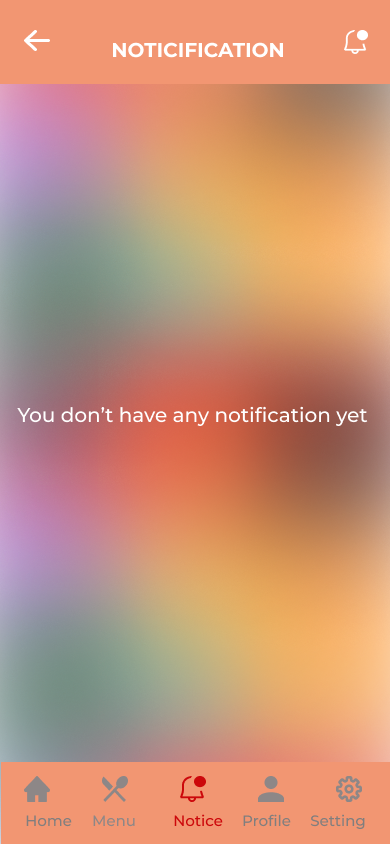

### Prototype
You can view the interactive prototype here:
[View Figma Prototype](https://www.figma.com/proto/5S5wtKYoLkQdZ0D4ujq2hu/My-food-app?page-id=0%3A1&node-id=275-3549&p=f&m=draw&scaling=scale-down&content-scaling=fixed&starting-point-node-id=23%3A311&t=yGTr5KLkIGjtEZhL-1))

